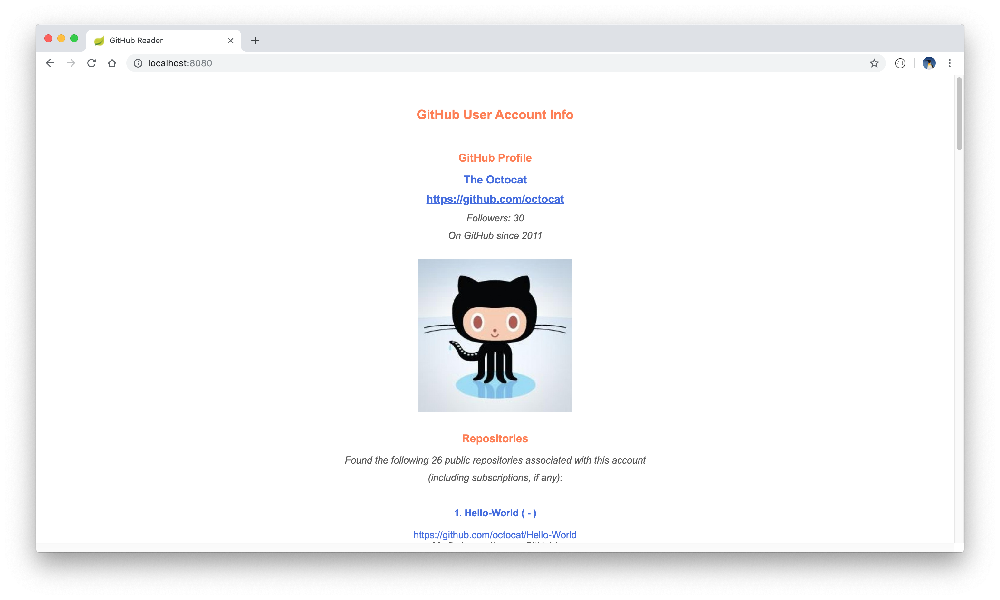
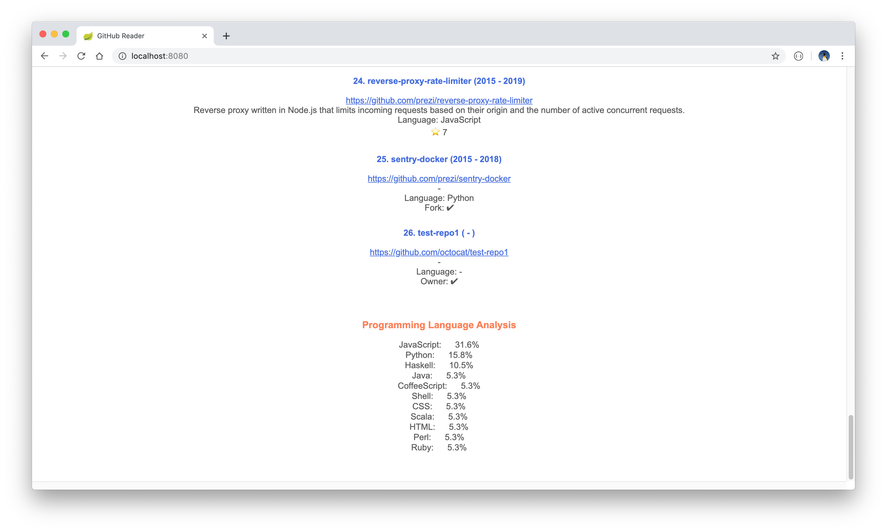

# GitHub Reader

A web-based reader to display GitHub repository information for a specific GitHub user given a valid GitHub account name. Note, all the information displayed in the Reader is information that has been made publicly accessible. No data regarding private repositories will be displayed.

The is a Spring Boot MVC project with ThymeLeaf, making use of the [GitHub Developer API](https://developer.github.com/v3/) to access the GitHub data.

## Requirements

* Java 11
* Spring Boot 2.2.1.RELEASE
* Spock

## Getting started

* Download or clone the project.
* Build the project with the command `mvn clean install` and start the project server by running the command `mvn spring-boot:run`. 
* The landing page can then be viewed in a browser via the link: `http://localhost:8080/`. Enter a valid GitHub account name, when prompted, in order to display the relevant user repository information. Information displayed includes the following:
	* The user name and short profile synopsis.
	* A hyperlink to the user's repository.
	* An associated avatar (if one is available).
	* A confirmation of the total number of repositories found for this user.
	* A summary of the repositories found. This list also includes subscriptions, where applicable.
	* A brief analysis of the programming languages used in these repositories.

Alternatively, import and run the Postman test collection. These can be found under `src/test/resources/com/cadebe/github_reader/Postman\ Tests/GitHub\ Reader.postman_collection.json`.

Unit tests, written with the Spock framework, can be run with the command `./mvnw test` (Linux and MacOS).

  
  

